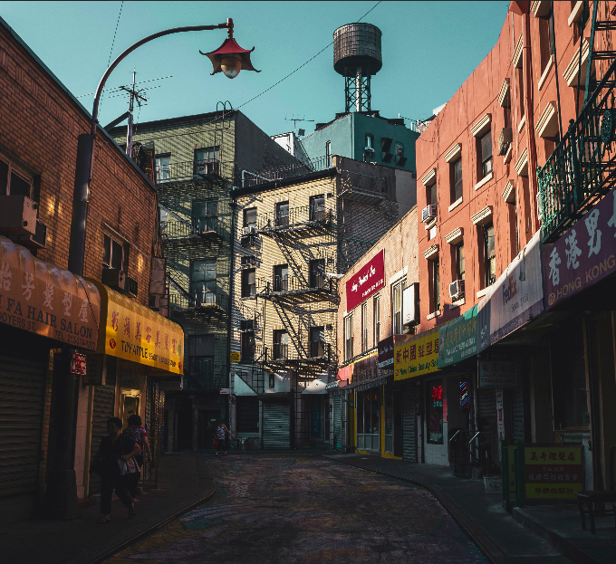
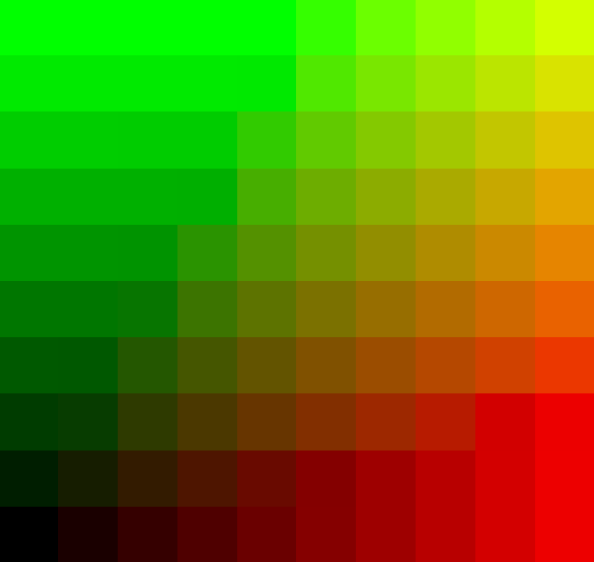
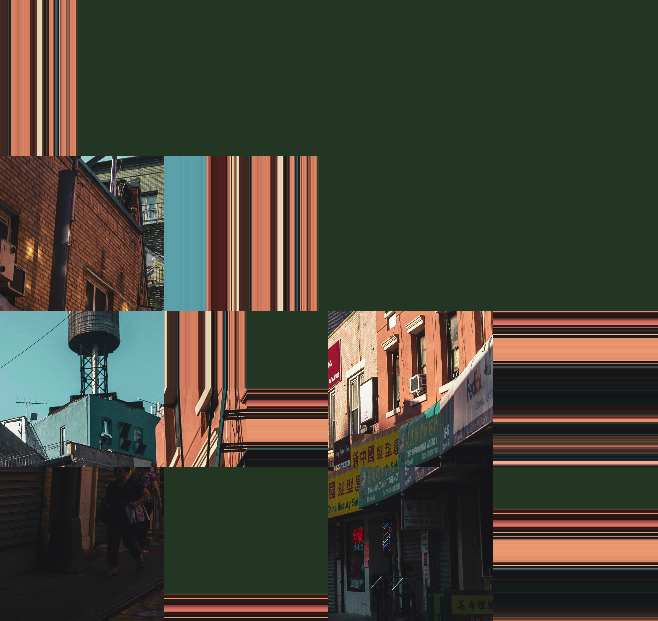
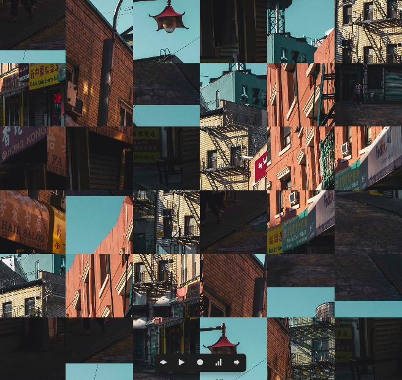
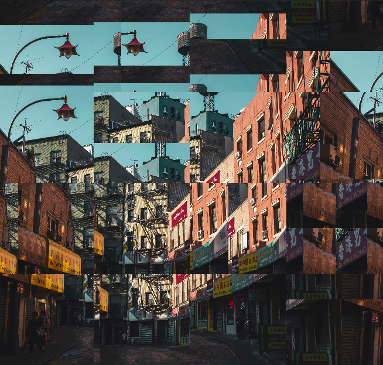
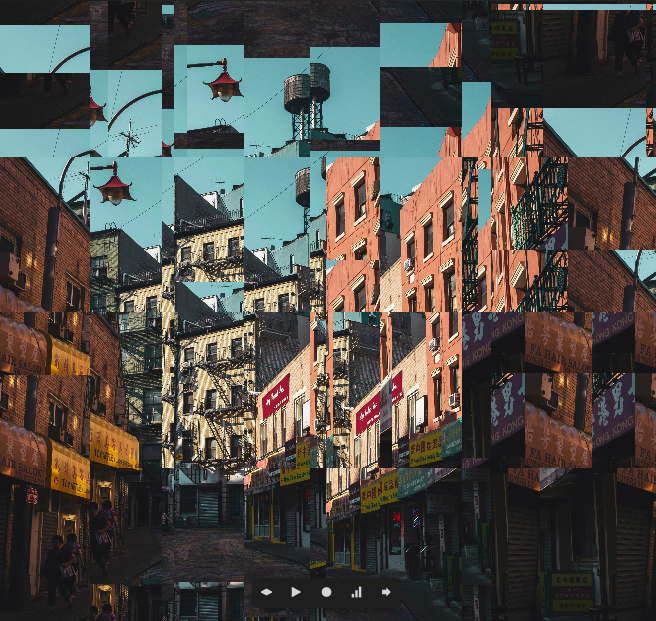
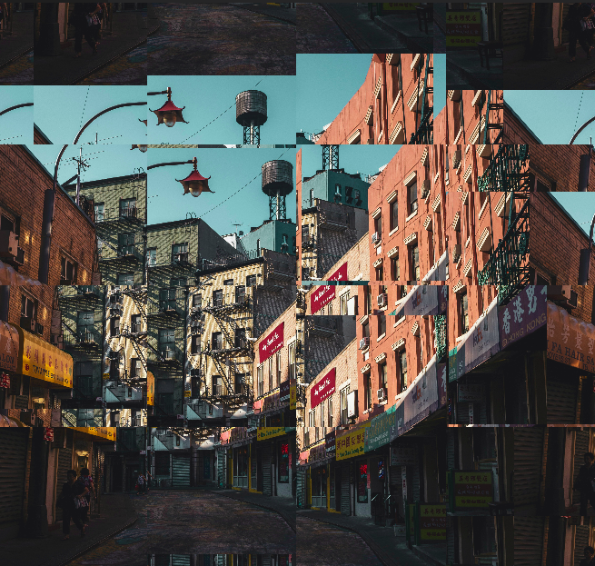

This is definitely not a week after the last article. And I think a part of the reason is because I haven't been studying shaders consistently. But hey, I'm back here, and so that is a good sign right? I hope it is. So today I want to talk about textures and make a simple shader that pixelates an image. 

### What is a texture you say

Simply put, texture is shader speak for image. When getting introduced to texture, and even during this article you will come across the term texture coordinates as well. Now this concept does not have a counterpart with respect to images, but it becomes inseparable from textures when it comes to shaders. If you have a texture, you must have texture coordinates. 

And this is the way it is because shaders have the capability to wrap a texture around 3D objects and in other ways as well. That is, you can use an image to cover a 3D model, for example a cylinder, in any number of ways you can imagine. To specify which part of an image goes where on a 2D plane or a 3D object, we need texture coordinates. This will become more clear as you use them yourself in a bit. 

### What are we waiting for

So to begin, let's write all the simple boilerplate that we need for our shader, and you should see a red screen. 

```glsl
#ifdef GL_ES
precision mediump float;
#endif

uniform vec2 u_resolution;
uniform vec2 u_mouse;
uniform float u_time;
uniform sampler2D u_texture_0;

void main() {
    gl_FragColor = vec4(1.0, 0.0, 0.0, 1.0);
}
```

You must have noticed that we have an extra uniform of type `sampler2D`, and this is our texture/image. If you are using [glsl-canvas](https://marketplace.visualstudio.com/items?itemName=circledev.glsl-canvas) on VSCode then you can define your texture location in the `settings.json` file of your current workspace and will have to use the name `u_texture_0` for the uniform. For more information on how to do this, you can look into the Textures section on the [extension page](https://marketplace.visualstudio.com/items?itemName=circledev.glsl-canvas). 

But we are not done yet displaying our image, since we are not using the texture inside the shader at all yet. So let's go ahead and do that. 

```glsl
void main() {
    vec2 st = gl_FragCoord.xy/u_resolution.xy;
    vec4 tex = texture2D(u_texture_0, st);

    gl_FragColor = tex;
}
```

To use a texture inside a shader, the function that glsl provides us is called `texture2D`. The first parameter for this function is the texture uniform and the second parameter is.. yes you guessed it, texture coordinates! 

[](https://unsplash.com/@geoffroyh?utm_source=unsplash&utm_medium=referral&utm_content=creditCopyText)

Side note: as you can probably tell from the code, texture coordinates usually range from 0 to 1 although this might not be so in some cases. But it would be safe to assume the range 0-1 for most cases. 

### PPiixxeellaattee

Now that we can display an image inside a shader, let's move to the next step and pixelate it. For doing this, do you think we should modify the texture coordinates, i.e. how we get pixels from an image, or the image after we get it using simple texture coordinates. Let's first try using the first approach.
And to get to that we'll first explore how to make a grid using a shader.

```glsl
void main() {
    vec2 st = gl_FragCoord.xy/u_resolution.xy;

    vec2 tex_coord = st;
    vec4 tex = texture2D(u_texture_0, tex_coord);

    float grid = random(floor(st*10.0));

    // gl_FragColor = tex;
    gl_FragColor = vec4(vec3(grid), 1.0);
}
```

If we try to unpack this line which defines our `grid`, we can see that we are first upscaling or zooming out by multiplying `st` with a float value and then flooring the space to get floored values like `0.0, 1.0, 2.0, 3.0, 4.0..`. This flooring operation essentially divides our entire space into a grid. When picking randomly from this floored grid, we start to get closer to our idea of pixellation.

```glsl
void main() {
    vec2 st = gl_FragCoord.xy/u_resolution.xy;

    vec2 tex_coord = st;
    vec4 tex = texture2D(u_texture_0, tex_coord);

    vec2 grid = floor(st*10.0)/10.0;

    // gl_FragColor = tex;
    gl_FragColor = vec4(vec3(grid.x, grid.y, 0.0), 1.0);
}
```


Side note: If you are wondering, like I was, how `floor` operation differs from `fract` operation, try and substitute! 

### Grid + texture = ?

Since we have all the ingredients for our recipe, let's plug them into action and see what happens!

```glsl
void main() {
    vec2 st = gl_FragCoord.xy/u_resolution.xy;
    
    float deg = 4.0;
    vec2 grid = vec2(random(floor(st*deg)));

    vec2 tex_coord = st+grid;
    vec4 tex = texture2D(u_texture_0, tex_coord);

    gl_FragColor = tex;
}
```



Oops what are these weird lines, we don't want those? Let us go back to what we said about texture coordinates. They range from 0 to 1, and since we are adding two vectors to each other, is it not possible for them to exceed this range..? What if we take only the `fract`ional part of the resulting vector?

```glsl
vec2 tex_coord = fract(st+grid);
```

Voila, we've done it! 



You can now try playing around with these different values, maybe change how you want to define the `deg` of pixelation. 
Here are a few things I got while messing around.







These looked much better in motion, but I haven't yet figured out how to use videos with Gatsby xD. You can try playing with motion as well by using the `u_time` uniform.
So until next time, which will hopefully be sooner, have fun! 💃