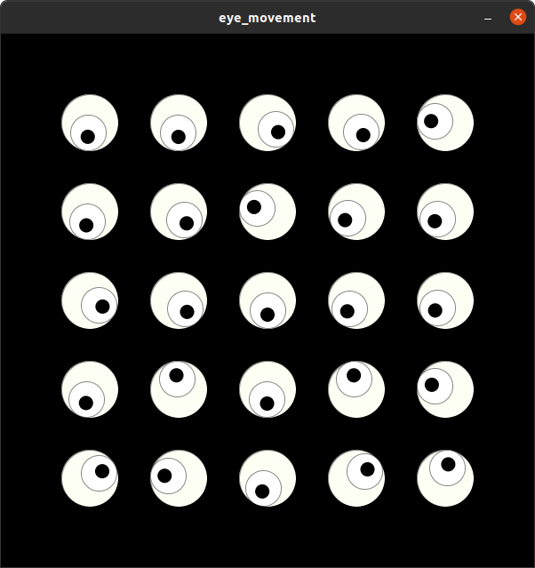
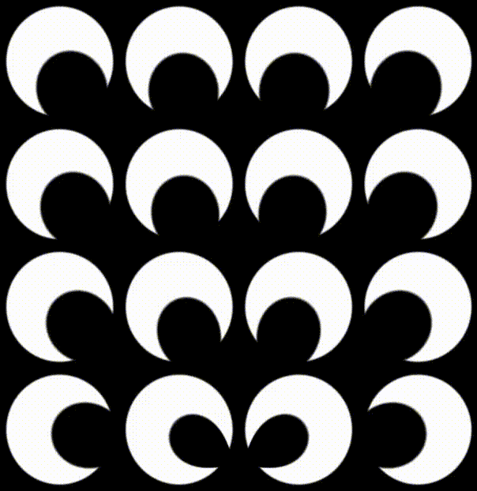

Hey! Yes since I have never written for THE Web before this is how I'll start. This is probably not going to be very good since aforementioned haha but hopefully if you are as new to shaders as I am, and are learning them yourself, you might find something of value in here. 

This article is the start of a series of articles that I plan on writing about shaders while learning how to write them. Documenting the learning process in this way will hopefully help me understand what areas I have covered, where I feel comfortable, and which parts I should focus on next. I've always been someone who starts something but never really gets around to finishing it, and so I hope that I can finally end that with these articles and have more understanding after, let's say a month, of [where I was and where I am headed](https://www.instagram.com/p/CLZmyd3B3vv/)([@kayserifserif](https://www.instagram.com/kayserifserif/), thank you for the inspiration!)

### Aand it's shader time 

Today I will be going through a shader I wrote to recreate an old sketch made in Processing. 



The Processing code uses an Eye class and some vector math that I thought was a bit overkill for the idea of the sketch, which is to have two circles, one inside the other, with the inner circle responding to mouse movement, and sort of imitate human eyes 👀 

To try out this shader and experiment with your own, it is very simple and easy to use an extension in VSCode, there is hardly any setup required and you'll be able to see the output right inside your editor with changes being reflected as you type them. I have been using [glsl-canvas](https://marketplace.visualstudio.com/items?itemName=circledev.glsl-canvas) but there are a few others as well.　

For our simple purposes we only need to know how to make circles and make them move using glsl. If you haven't already heard of the [Book of Shaders](https://thebookofshaders.com/), leave this simple minded article right now and head over there because I could never be as succint and amazing in explaining the smallest details or big picture ideas about shaders, and the site is just beautiful. 🖤 But if you already know a bit about Fragment Shaders, you'll know that we need a `main` function, some necessary directives and uniforms and a function to make a circle to begin with. 

The circle function takes as its input a vector describing the coordinate space of the canvas, a vector for the center of the circle in this coordinate space and a radius value. We're drawing the circle based on the distance between each pixel and the center of the circle. So a color will be calculated for each pixel based on how far it is from the center of the circle. I referred the Book of Shaders [shaping](https://thebookofshaders.com/05/) page myself because this part is not always easy to understand and it takes a lot of time and practice to develop the intuition that'll let you write amazing shaping functions in glsl. Bless us all, Mr Miyagi! 

``` glsl
#ifdef GL_ES
precision mediump float;
#endif

uniform vec2 u_resolution;
uniform vec2 u_mouse;
uniform float u_time;

float circle(vec2 _st, vec2 _pos, float _radius) {
    vec2 dist = _pos-_st;
    dist *= 0.5;
    float val = smoothstep(_radius-0.01, _radius+0.01, dot(dist,dist)*4.0);
    return val;
}

void main() {
    vec2 st = gl_FragCoord.xy/u_resolution.xy;
    gl_FragColor = vec4(1.0, 0.0, 0.0, 1.0);
}

```

But for now, since we are not using the circle function inside `main` you should only see red if you run this shader. On with circles, now ⚫⚪🔴

```glsl
void main() {
    vec2 st = gl_FragCoord.xy/u_resolution.xy;
    float c = 1.0-circle(fract(st*2.0), vec2(0.5), 0.2);

    gl_FragColor = vec4(vec3(c), 1.0);
}

```

You might be wondering what is this `fract` business we've got going here and so I will try to explain. Inside our shader the coordinate space, i.e. `st` lies between 0.0 and 1.0 since we are normalizing using the resolution of the screen, `u_resolution`. [fract](https://thebookofshaders.com/glossary/?search=fract) is a glsl function that returns the fractional value of any number. I am using it here to be able to draw more than one circle while only using `vec(0.5)` as the location for all the circles. The subtraction in the beginning is to reverse the color of circle and background. 

To make the smaller circle within the bigger circle, we'll call the `circle` function again, giving it the same coordinate space and a smaller radius, but we don't want it to be stationary. Let's set the location as a function of the uniform `u_time`. We want the small circle to move in a circle(yay circles!), so by using `u_time` as our angle, we can calculate the x and y location

```glsl
    x = cos(u_time) * radius
    y = sin(u_time) * radius
```
Finally we will add 0.5 as an offset to center the smaller circle within the big circle. When finally setting `gl_FragColor` in the last line, we will multiply the values for both circles. This would be equivalent to an `and` operation, in shader terms, combining both the results. Also notice how we subtract from 1.0 with only the bigger circle and not the smaller one. You could try playing with this to get a better feel for how things are working. 

```glsl
void main() {
    vec2 st = gl_FragCoord.xy/u_resolution.xy;
    float c = 1.0-circle(fract(st*2.0), vec2(0.5), 0.2);

    float smallc_len = 0.25;
    vec2 smallc_pos = vec2(cos(u_time)*smallc_len, sin(u_time)*smallc_len)+0.5;
    float smallc = circle(fract(st*2.0), vec2(smallc_pos), 0.1);

    gl_FragColor = vec4(vec3(c*smallc), 1.0);
}

```

The only thing remaining now is to add mouse interaction 🐁 since we don't want all the circles looking in the same direction, which is what happens if we use any uniform as that value would be the same for all our pixels.  

For this we'll first normalise the uniform `u_mouse` just like we normalised the coordinates. And then make a vector starting from the pixel position pointing towards the mouse. We can now use this vector to calculate an angle using inverse tangent. 

```glsl
void main() {
    vec2 st = gl_FragCoord.xy/u_resolution.xy;
    vec2 m = u_mouse.xy/u_resolution.xy;

    vec2 dir = m-st;
    float dirangle = atan(dir.y, dir.x);

    float c = 1.0-circle(fract(st*4.0), vec2(0.5), 0.2);

    float smallc_len = 0.25;
    vec2 smallc_pos = vec2(cos(dirangle)*smallc_len, sin(dirangle)*smallc_len)+0.5;
    float smallc = circle(fract(st*4.0), vec2(smallc_pos), 0.1);

    gl_FragColor = vec4(vec3(c*smallc), 1.0);
}
```
And if we just plug this angle into our smaller circles, tada, we have our shader! 



If you have something to share, thoughts about this article, or any mistakes that you thought were made(very probable), please feel free to reach out to me on Instagram, link in footer. 💃 That's all for this time, hopefully there will be more soon. 