I recently saw a [documentary](https://www.youtube.com/watch?v=WDWzY95EEbA&t=64s) about Mondrian and although the images of his paintings in the video were of not the best quality and there is an annoying watermark throughout, dare I say I maybe understood what Mondrian was trying to say. Having recently come across Vasudeo Gaitonde and S H Raza, I have come to appreciate color much more and how the right amount in the right places could really be something. Black and white is evergreen (sorry 😂) but imagine a world without color. 

### A bit of history

[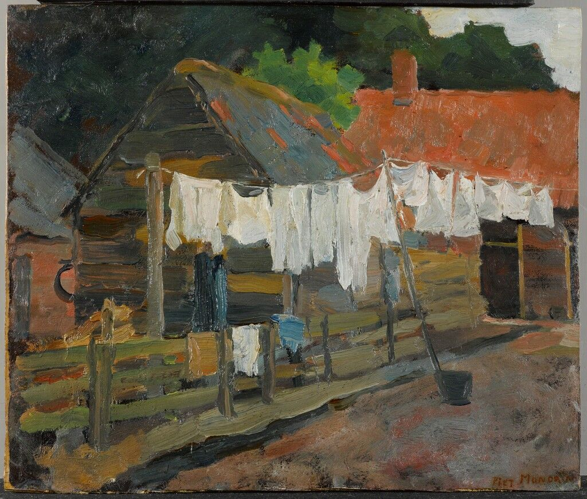](https://www.artsy.net/artwork/piet-mondrian-farmhouse-with-wash-on-the-line)

Piet Mondrian, whose father was a drawing teacher and whose mother we don't find much about (but she also probably did something) was introduced to art and painting since a very young age. He also had an uncle with whom he painted often and after getting a degree in Fine Arts became qualified to teach but his career was to become a tad bit bigger than that. 

[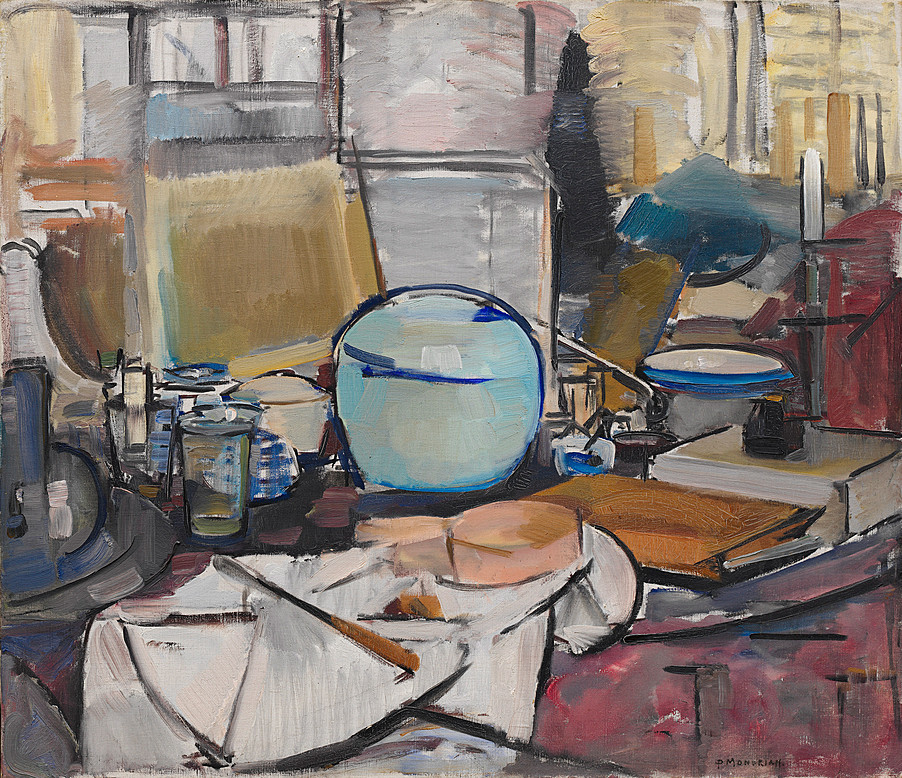](https://artleove.co/piet-mondrian-color-harmony-and-rhythm/)

[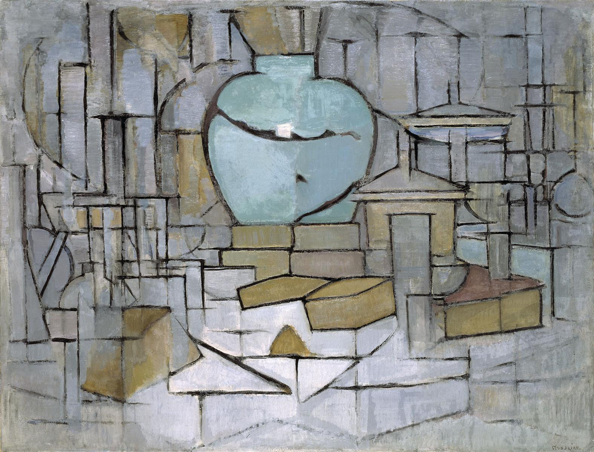](https://artleove.co/piet-mondrian-color-harmony-and-rhythm/)

He was inspired by Cubism and Pablo Picasso and the Paris avant-garde scene at the time and it started reflecting in how he painted. Due to World War I, he was stuck back home, and could not return to Paris, and it was during this time that he met fellow artists, Bart van der Leck and Theo van Doesburg, and with Doesburg started a magazine called De Stijl and in it publishing essays about why he painted the way he painted.

[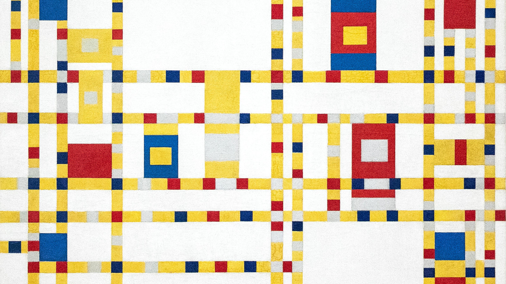](https://www.nytimes.com/2019/06/06/arts/design/broadway-boogie-woogie-moma.html)

His thinking was based on his belief in [Theosophy](https://en.wikipedia.org/wiki/Theosophy) and in his words, he wanted [to articulate a mystic conception of cosmic harmony that lay behind the surfaces of reality.](https://www.artsy.net/article/matthew-how-mondrian-went-abstract) 

I am not quite sure what it is about these paintings that interests me but as someone who has been aiming for brevity in the things that I make, I decided to make myself a Mondrian! 🎉

### On with it now

As always, we will begin with our boilerplate, define our colors, and start with a nice bright red to soothe the eye.

```glsl
#ifdef GL_ES
precision mediump float;
#endif

uniform vec2 u_resolution;
uniform float u_time;

#include "../lygia/generative/random.glsl";
#include "../lygia/generative/cnoise.glsl";

#define RED      vec3(1.0, 0.0, 0.0)
#define YELLOW   vec3(1.0, 1.0, 0.0)
#define BLUE     vec3(0.0, 0.0, 1.0)
#define WHITE    vec3(1.0, 1.0, 1.0)

void main() {
  vec2 st = gl_FragCoord.xy/u_resolution.xy;
  gl_FragColor = vec4(RED, 1.0);
}
```

What we have also done here is [include](https://en.wikipedia.org/wiki/OpenGL_Shading_Language#Preprocessor) two other glsl files, and those of you familiar with some c programming would have seen this before, but even if you haven't, it is nothing scary. This is a simple straightforward way to use functions and code from another file, by doing exactly what it says, including them at the beginning of our own code. What comes after `#include` is a file path, relative to the location of your current shader. And so for me, [lygia](https://github.com/patriciogonzalezvivo/lygia) is in the folder outside the folder I am in now, like so

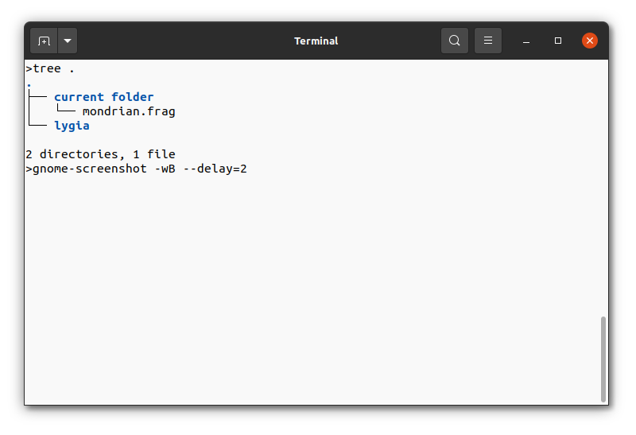

And just to take a little space to gush about lygia, it is a wonderful library with a whole lot of functions ranging from drawing shapes to manipulating color and space. It is created by [Patricio Gonzalez Vivo](http://patriciogonzalezvivo.com/), also one of the co authors of the [book of shaders](https://thebookofshaders.com/) and the creator of [glslViewer](https://github.com/patriciogonzalezvivo/glslViewer) ❤️ Honestly, where would I be if not for these amazing tools and resources! ✨️

With lygia, as you can probably figure, it is much simpler to now have access to functions like `noise` and `random`, which we would have originally had to copy paste inside our shader. About the `#include`, it did not work in the vscode extension [glsl-canvas](https://marketplace.visualstudio.com/items?itemName=circledev.glsl-canvas) last time I checked so you may want to go ahead and install glslViewer 👩‍💻

Now what characterizes a Mondrian are the straight lines, horizontal and vertical and the three primary colors 🔴🌕🔵 which are the only elements that he thought were necessary. Even diagonals are not allowed, and side note, he cut away from Theo van Doesburg after a disagreement on this exact subject. 

So we figure we need to construct a grid in a somewhat non regular manner and then start filling the boxes of the grid with color. Atleast that is what we will try to do. 🙌

### Grid up

```glsl
void main() {
  vec2 st = gl_FragCoord.xy/u_resolution.xy;
  float size = 5.0;

  vec2 grid = st;
  grid.x *= cnoise(vec2(st.x))*size;
  grid.y *= cnoise(vec2(st.y))*size;

  float rows = step(0.5, fract(grid.y)) == 0.0 ? 0.5 : 0.0;
  vec3 cols = vec3(step(0.5, fract(grid.x + rows))); 

  gl_FragColor = vec4(cols, 1.0);
}
```

To make the grid, we can pick up from where we left in the last article and expand our space `st` but this time using `cnoise`, an implementation of classic perlin noise from the lygia library, to create non regularity in a controlled manner. `cnoise` takes in a `vec2`, so now `grid` would range between `0-size` in both directions, and this way also produced a symmetry along the x axis. There must be tons of other, probably better ways to get non uniform grids but we will stick with this for now.

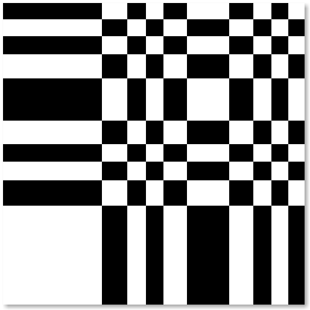

### Fill in the color

Now that we have our black and white grid, we can move on to adding color. We are going to use a glsl function called [`mix`](https://thebookofshaders.com/glossary/?search=mix) which can be used for many things but, from what little glsl code I have seen, it is usually used to transition smoothly between colors based on a function. 

To start, we need to select rectangles from this grid and then fill them with 🔴, 🌕, or 🔵. To give a random gray color to parts of a grid we can do something like so 

```glsl
float random_c = floor(grid.x + rows)/size;
// vec2 random_c = floor(vec2(grid.x + rows, grid.y*2.0))/size;
cols = vec3(random(random_c));
```

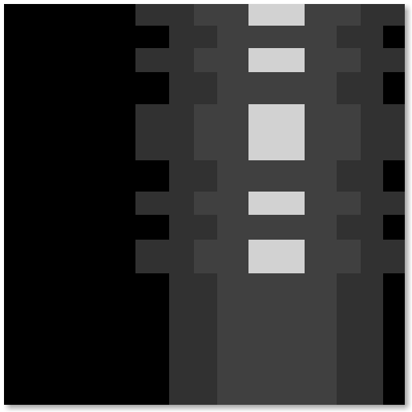

This chooses a random `float` based on `grid.x+rows` which is essentially our columns, and same values of rgb give it the color between white and black that we see. Again, this is just one of the ways to do this, because as the title says, we are going to fail to make a Mondrian so go ahead and comment out the second line and use that if you like! 

We will do this process three times for our three colors, and then mix in those colors with a white background based on the values that we'll get. 

```glsl
vec3 colorf = vec3(0.0);
colorf.x = step(0.0, random(random_c));
colorf.y = step(0.1, random(random_c));
colorf.z = step(0.4, random(random_c));

gl_FragColor = vec4(colorf, 1.0);
```

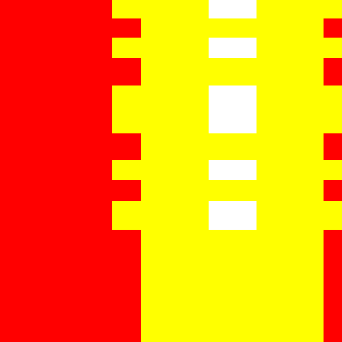

With the `step` function, we are splitting the random space from `random(random_c)` into two parts, like colored/not colored, and red/not red and so forth. You can try tweaking the first value in `step` function and see the change that it makes. 

Now using these values we will finally start mixing in the colors that we want 🎨 The `mix` function in glsl takes three arguements, the first two of which are the colors to be mixed, and the third is the function which mixes them. So if we say `mix(WHITE, BLACK, 0.0)` we would get the color `WHITE` and `mix(WHITE, BLACK, 1.0)` would give us `BLACK`. We can also do this iteratively by mixing further into the color that we get in a previous step like so.

```glsl
vec3 color = WHITE;
color = mix(color, RED, colorf.x);
color = mix(color, YELLOW, colorf.y);
color = mix(color, BLUE, colorf.z);

gl_FragColor = vec4(color, 1.0);
```

For a much detailed and thorough explanation do check the [color chapter](https://thebookofshaders.com/06/) from the book of shaders. Our code above makes sure that only these three colors fill different parts of the grid and not any other color combinations. 

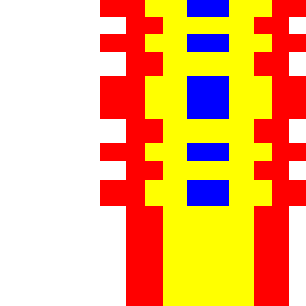

As an extra exercise we can also try outlining all the grid cells that we have, again using the `step` and `mix` functions. Doing the outlining before the colors would hide it, just like if we were doing it on paper, so we will add it in the end. 

```glsl
vec2 outline = step(0.1, fract(vec2(grid.x + rows, grid.y*2.0)));
vec3 color = WHITE;
color = mix(color, RED, colorf.x);
color = mix(color, YELLOW, colorf.y);
color = mix(color, BLUE, colorf.z);
color = mix(color, 1.0-WHITE, 1.0-outline.y);
color = mix(color, 1.0-WHITE, 1.0-step(0.1, fract(grid.y*2.0)));
color = mix(color, 1.0-WHITE, 1.0-outline.x);
```

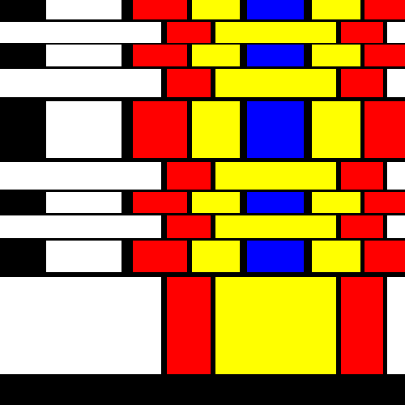

And that's it, we'll stop here but there are tons of ways this can go further like using the uniform `u_time` and incorporating it in constructing our grid so the grid could move. 

Here are a few things I made, hope you have fun making yours 💃👏

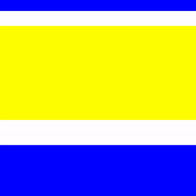

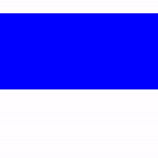

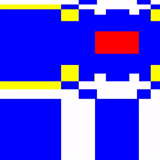